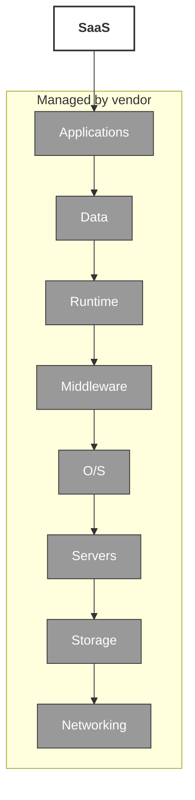
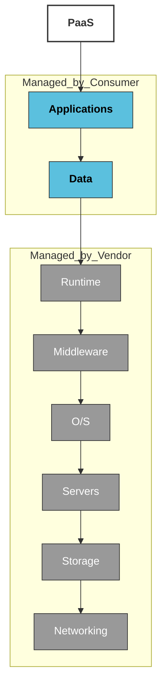
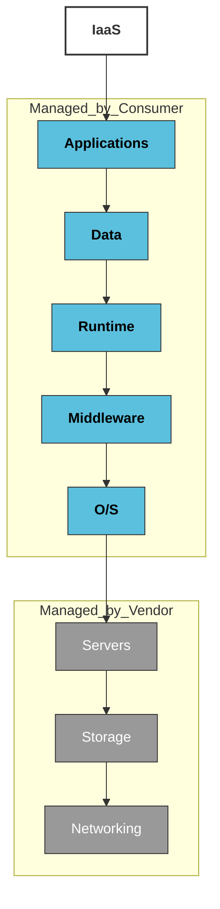

# 1. Understanding the Modern Cybersecurity Landscape

## Modern Computing Trends

La naturaleza del computo empresarial ha cambiado a lo largo en demasia a lo largo de la ultima decada. 

### Introduccion a la web y aplicaciones web 2.0

Las aplicaciones pricipales de negocio estan comunmente instaladas a lo largo de apliaciones web 2.0 en una variedad de endpoints. Redes que originalmente fueron diseñadas para compartir archivos y tener impresoras, son usadas para recolectar volumentes masivos de datos, intercarbiar informacion en tiempo real, llevar a cabo transacciones online y permitier la colabroacion mundial. Muchas de estas web apps 2.0 estan disponibles como SaaS, basadas en web, o como apps moviles, que se pueden instalar facilmente por los usuarios o que pueden ser usadas sin instalar programas adicionales en el endpoint. Este uso de web apps 2.0 in las empresas se refiere como empresas 2.0, de la se reconocen multiples beneficios, como una mejor colaboración, una mejor distribucion del conocimiento y la reduccion de gastos. 

Algunos ejemplos de web 2.0 apps son: 

* File Sync and Sharing Services
* Instant Messaging (IM)
* Microblogging
* Office Productivity Suites
* Remote Access Software
* Remote Team Meeting Software
* Social Networks
* Web-Based Email
* Wikis

### Web 3.0

La vision de la web 3.0 es regresar el poder del internet al usuario, de la misma forma con la que fue pensada la web 1.0. Alejandose de la actalidad de la Web 2.0, la que ha sido moldeada y controlada por los gobiernos y grandes empresas, que dictan el contenido que esta disponible y el que no. Dejando muchas preocupaciones sobre la seguridad, privacidad y libertad de los usuarios. 

Y las tecnolgias que ayudaran a esta web 3.0 seran: 

* AI and Machine Learning
* Blockchain
* Data Mining
* Mixed Reality
* Natural Language Search

## New Application Threat Vectors

Explotar vulnerabilidades en las aplicaciones principales de los negocios, siempre ha sido el vector de ataque predominante, pero los actores de amenaza evolucionan desarrollando nuevas tacticas, tecnicas y procedimientos (TTPs - Tactics, Techniques and procedurs).

### Protect Networks and Cloud Eviroments

Para proteger efectivamente las redes y entornos en la nube, los equipos de seguridad empresariales deben manejar los riesgos asociados a un conjunto relativamente limitado y conocido de aplicaciones básicas, asi como los riesgos asociados al número cada vez mayor de aplicaiones conocidas y desconocidas de la nube. 

### Clasificación de aplicaciones

Muchas aplicaciones estan diseñadas para eludir firewalls basados en puertos, y estos pueden ser facilmente instalados y acceder a cualquier dispositivo. 

La clasificacion de aplicaicones como bueans o malas, se esta volviendo extremandamente dificl, ya que muchas aplicaiones son claramente buenas (bajo riesgo, alta recompensa) o claramente malas (alto riesgo, baja recompensa), pero otras estan en esta escala de grises que depende mas de como se usen que otra cosa. 

Muchas organizaciones, usan redes sociales como Facebook para funciones importantes, como reclutar, marketing, etc. pero estas misma pueden ser usadas para lekear informacion confidencial, o causar un daño a la marca. 

### Tactics, Techniques, and Procedurs (TTPs)

A continuacion de mencionan algunas TTPs: 

* Port Hopping: permite a los atacantes, cambiar de forma aleatoria los puertos y protocolos duranta una sesion.
* Using Non-Standard Ports: Un ejemplo de esto es correr Yahoo! Messenger en el puerto 80 TCP (HTTP) en vez del puerto estadar para esta herramienta que es el 5050.
* Tunneling: Este consiste en crear tuneles dentro de servicios de uso comun, como el intercambio de archivos Peer-to-Peer o un cliente de mensajeria instantanea a traves del HTTP.
* Hiding Within SSL Encryption: En esta el cifrado SSL oculta el trafico de la aplicacion, a traves del puerto TCP 443 (HTTPS). Más de la mitad del trafico web actual esta cifrado. 

## Turbulence in the cloud

Las tecnologias de computo en la nube ayudan a las organizaciones a evolucionar sus centros de datos de una mentalidad basada en el hardware a una dinamica y automaizada. Estos entornos en la nbe con sus recursos bajo demanda ayudan a que el flujo de trabajo dando acceso en cualquier momento. 

## Service models

En el computo en la nube existen tres modelos se servicio, SaaS (Software as a Service), PaaS (Platform as a service) y IaaS (Infraesstructure as a Service).

### SaaS 

En este modelo, se le ofrece al consumidor la capacidad de utilizar aplicaciones del proveedor que se ejecutan en la nube. El consumidor no controla ni gestionala infraestructura en la nube, incluidad la red, servidores, SO, almacenamiento, o capacidades de las aplicaciones. 

### PaaS

En este modelo, la capacidad que se ofrece al consumidor es la de implementar en la infraestructura en la nube aplicaciones creadas o adquiridas por el consumidor utilizando leguajes de programación, bibliotecas, servicios y herramientas compatibles con el proveedor. El consumidor no gestiona la infraestrucutra, la red, los servidores, los sistemas operativos, o el almacenamiento. Pero si controla las aplicaciones implementadas, y la configuracion del entorno de alojamiento. 

### IaaS

En este modelo, se ofrece al consumidor la capacidad de provision de procesamiento, almacenmamiento, redes y otros recursos informaticos fundamentales, donde el consumidor puede implementar y ejecutar software arbitrario, que puede incluir sistemas operativos y aplicacioens. En este el consumidor no gestiona ni controla la infraestructura subyacente de la nube, pero si controla los SO, almacenamiento y aplicaciones implementadas, con un control limtado sobre componentes de red como los firewalls. 

## SaaS, PaaS, and IaaS Use Cases

Palo alto networks inicio una estrategia unificada con XDR. Y ahora la industria lo esta siguiendo. 

* SaaS: Estos servicios en la nube estan hosteados por el CSP y estan disponibles para los consumidores con el modelo pay-as-you-go.
* PaaS: este modelo es perfecto para los desarrolladores de software ya que es compatible con diferentes leguajes de programación, y se tiene control total para crear software modificado. La principal funcion de este es dar un fremework util para los desarrolladores.
* IaaS: La principal funcion de este modelo es proveer de forma visual la informacion de los data ceters a los negocios. 

## Hypergrowth of SaaS Applications

Las organizaciones cada vez tiene una dependencia mayor en el uso de estas aplicaciones. Ya que muchas de de estas como Slack, Teams, Zoom, Jira and Confluence (todas aplicaciones SaaS). Ya que ayudan a la agilidad del negocio permitiendo una mejor comunicacion y mucho mas eficiente. 

### Risk Associated with SaaS Application 

Las aplicaciones SaaS pueden ser dañinas y crear nuevos riesgos si no son mitigados de forma segura. Teniendo los siguientes riesgos: 

* Exposicion de informacion confidencial
* Amenazas basadas en la nube
* Aplicaiones SaaS peligrosas
* Perdida de visibilidad y control

## SaaS Application Risks

El uso de aplicaciones SaaS es algo comun para los usuarios de una empresa. Lo que aumenta los riesgos de que informacion sensible sea robada, expuesta o que sea comprometida. 

### Retos de seguridad en SaaS

Debido a la naturaleza de las aplicaciones SaaS, mantener un control del sobre su uso es muy dificil. Esta falta de control representa un reto de ciberseguridad. 

* Malicious Outsiders: La brecha mas comun para las redes en general, tambien aplica para las seguridad SaaS. Estas aplicaciones se transforman en un nuevo vector de ataque y distribución de malware usado por los agentes de amenaza. Y mucho de este malware apunta a estas aplicaciones SaaS.
* Malicious Insiders: El menos comun, pero el riesgo mas real de las aplicaciones SaaS son los usuarios internos que de forma maliciosa comparten informacion con objetivos maliciosos. 
* Accidental Data Exposure: Este riego es e bastante comun, ya que no depende de las intenciones de los usuarios, si no mas de los errores humanos. Ya que estas aplicaciones estan diseñadas para compartir de forma facil informacion y de forma equivoca esta informacion puede terminar en malas manos.
* Accidental Share: este sucede cuando por una razon se comparte informacion a una persona o grupo incorrecto.
* Promiscous Share: Esto sucede cuando se comparte publicamente la informaicon por medio de un usuario a otro que no deberia tener esta información.
* Ghost share: este consiste en una cuenta que permanece activa para un empleado o proveedor que ya no trabaja en la empresa o que ya no deberia tener acceso. 

## Estandares y regulaciones

Las grandes organizaciones manejan una gran cantidad de informacion, y por esto son el principal objetivo para los cibercriminales. Y estos estandares y regulaciones son los que se encargan de proteger y asegurar la info. 

### Payment Card Industry’s Data Security Standard 

La Norma de Seguridad de Datos de la Industria de Tarjetas de Pago (PCI DSS) establece sus propias normas de ciberseguridad y mejores prácticas para las empresas y organizaciones que permiten compras con tarjetas de pago. Un número cada vez mayor de leyes y reglamentos internacionales, multinacionales, federales, regionales, estatales y locales también imponen numerosos requisitos de ciberseguridad y protección de datos a las empresas y organizaciones de todo el mundo.

### European Union General Data Protection Regulations

El Reglamento General de Protección de Datos (RGPD) de la Unión Europea (UE) se aplica a cualquier organización que realice negocios con ciudadanos de la UE. Las normas del RGPD suelen aplicar estándares más estrictos para la protección de los usuarios finales y los datos que los que se aplican a nivel nacional. Algunas empresas nacionales han adoptado una política de cumplimiento de las normas del RGPD, por si acaso sus operaciones pudieran interactuar con consumidores europeos o internacionales.

