# 1. Understanding the Modern Cybersecurity Landscape

## Modern Computing Trends

La naturaleza del computo empresarial ha cambiado a lo largo en demasia a lo largo de la ultima decada. 

### Introduccion a la web y aplicaciones web 2.0

Las aplicaciones pricipales de negocio estan comunmente instaladas a lo largo de apliaciones web 2.0 en una variedad de endpoints. Redes que originalmente fueron diseñadas para compartir archivos y tener impresoras, son usadas para recolectar volumentes masivos de datos, intercarbiar informacion en tiempo real, llevar a cabo transacciones online y permitier la colabroacion mundial. Muchas de estas web apps 2.0 estan disponibles como SaaS, basadas en web, o como apps moviles, que se pueden instalar facilmente por los usuarios o que pueden ser usadas sin instalar programas adicionales en el endpoint. Este uso de web apps 2.0 in las empresas se refiere como empresas 2.0, de la se reconocen multiples beneficios, como una mejor colaboración, una mejor distribucion del conocimiento y la reduccion de gastos. 

Algunos ejemplos de web 2.0 apps son: 

* File Sync and Sharing Services
* Instant Messaging (IM)
* Microblogging
* Office Productivity Suites
* Remote Access Software
* Remote Team Meeting Software
* Social Networks
* Web-Based Email
* Wikis

### Web 3.0

La vision de la web 3.0 es regresar el poder del internet al usuario, de la misma forma con la que fue pensada la web 1.0. Alejandose de la actalidad de la Web 2.0, la que ha sido moldeada y controlada por los gobiernos y grandes empresas, que dictan el contenido que esta disponible y el que no. Dejando muchas preocupaciones sobre la seguridad, privacidad y libertad de los usuarios. 

Y las tecnolgias que ayudaran a esta web 3.0 seran: 

* AI and Machine Learning
* Blockchain
* Data Mining
* Mixed Reality
* Natural Language Search

## New Application Threat Vectors

Explotar vulnerabilidades en las aplicaciones principales de los negocios, siempre ha sido el vector de ataque predominante, pero los actores de amenaza evolucionan desarrollando nuevas tacticas, tecnicas y procedimientos (TTPs - Tactics, Techniques and procedurs).

### Protect Networks and Cloud Eviroments

Para proteger efectivamente las redes y entornos en la nube, los equipos de seguridad empresariales deben manejar los riesgos asociados a un conjunto relativamente limitado y conocido de aplicaciones básicas, asi como los riesgos asociados al número cada vez mayor de aplicaiones conocidas y desconocidas de la nube. 

### Clasificación de aplicaciones

Muchas aplicaciones estan diseñadas para eludir firewalls basados en puertos, y estos pueden ser facilmente instalados y acceder a cualquier dispositivo. 

La clasificacion de aplicaicones como bueans o malas, se esta volviendo extremandamente dificl, ya que muchas aplicaiones son claramente buenas (bajo riesgo, alta recompensa) o claramente malas (alto riesgo, baja recompensa), pero otras estan en esta escala de grises que depende mas de como se usen que otra cosa. 

Muchas organizaciones, usan redes sociales como Facebook para funciones importantes, como reclutar, marketing, etc. pero estas misma pueden ser usadas para lekear informacion confidencial, o causar un daño a la marca. 

### Tactics, Techniques, and Procedurs (TTPs)

A continuacion de mencionan algunas TTPs: 

* Port Hopping: permite a los atacantes, cambiar de forma aleatoria los puertos y protocolos duranta una sesion.
* Using Non-Standard Ports: Un ejemplo de esto es correr Yahoo! Messenger en el puerto 80 TCP (HTTP) en vez del puerto estadar para esta herramienta que es el 5050.
* Tunneling: Este consiste en crear tuneles dentro de servicios de uso comun, como el intercambio de archivos Peer-to-Peer o un cliente de mensajeria instantanea a traves del HTTP.
* Hiding Within SSL Encryption: En esta el cifrado SSL oculta el trafico de la aplicacion, a traves del puerto TCP 443 (HTTPS). Más de la mitad del trafico web actual esta cifrado. 

## Turbulence in the cloud

Las tecnologias de computo en la nube ayudan a las organizaciones a evolucionar sus centros de datos de una mentalidad basada en el hardware a una dinamica y automaizada. Estos entornos en la nbe con sus recursos bajo demanda ayudan a que el flujo de trabajo dando acceso en cualquier momento. 

## Service models

En el computo en la nube existen tres modelos se servicio, SaaS (Software as a Service), PaaS (Platform as a service) y IaaS (Infraesstructure as a Service).

### SaaS 

En este modelo, se le ofrece al consumidor la capacidad de utilizar aplicaciones del proveedor que se ejecutan en la nube. El consumidor no controla ni gestionala infraestructura en la nube, incluidad la red, servidores, SO, almacenamiento, o capacidades de las aplicaciones. 

### PaaS

En este modelo, la capacidad que se ofrece al consumidor es la de implementar en la infraestructura en la nube aplicaciones creadas o adquiridas por el consumidor utilizando leguajes de programación, bibliotecas, servicios y herramientas compatibles con el proveedor. El consumidor no gestiona la infraestrucutra, la red, los servidores, los sistemas operativos, o el almacenamiento. Pero si controla las aplicaciones implementadas, y la configuracion del entorno de alojamiento. 

### IaaS

En este modelo, se ofrece al consumidor la capacidad de provision de procesamiento, almacenmamiento, redes y otros recursos informaticos fundamentales, donde el consumidor puede implementar y ejecutar software arbitrario, que puede incluir sistemas operativos y aplicacioens. En este el consumidor no gestiona ni controla la infraestructura subyacente de la nube, pero si controla los SO, almacenamiento y aplicaciones implementadas, con un control limtado sobre componentes de red como los firewalls. 

## SaaS, PaaS, and IaaS Use Cases

Palo alto networks inicio una estrategia unificada con XDR. Y ahora la industria lo esta siguiendo. 

* SaaS: Estos servicios en la nube estan hosteados por el CSP y estan disponibles para los consumidores con el modelo pay-as-you-go.
* PaaS: este modelo es perfecto para los desarrolladores de software ya que es compatible con diferentes leguajes de programación, y se tiene control total para crear software modificado. La principal funcion de este es dar un fremework util para los desarrolladores.
* IaaS: La principal funcion de este modelo es proveer de forma visual la informacion de los data ceters a los negocios. 

## Hypergrowth of SaaS Applications

Las organizaciones cada vez tiene una dependencia mayor en el uso de estas aplicaciones. Ya que muchas de de estas como Slack, Teams, Zoom, Jira and Confluence (todas aplicaciones SaaS). Ya que ayudan a la agilidad del negocio permitiendo una mejor comunicacion y mucho mas eficiente. 

### Risk Associated with SaaS Application 

Las aplicaciones SaaS pueden ser dañinas y crear nuevos riesgos si no son mitigados de forma segura. Teniendo los siguientes riesgos: 

* Exposicion de informacion confidencial
* Amenazas basadas en la nube
* Aplicaiones SaaS peligrosas
* Perdida de visibilidad y control

## SaaS Application Risks

El uso de aplicaciones SaaS es algo comun para los usuarios de una empresa. Lo que aumenta los riesgos de que informacion sensible sea robada, expuesta o que sea comprometida. 

### Retos de seguridad en SaaS

Debido a la naturaleza de las aplicaciones SaaS, mantener un control del sobre su uso es muy dificil. Esta falta de control representa un reto de ciberseguridad. 

* Malicious Outsiders: La brecha mas comun para las redes en general, tambien aplica para las seguridad SaaS. Estas aplicaciones se transforman en un nuevo vector de ataque y distribución de malware usado por los agentes de amenaza. Y mucho de este malware apunta a estas aplicaciones SaaS.
* Malicious Insiders: El menos comun, pero el riesgo mas real de las aplicaciones SaaS son los usuarios internos que de forma maliciosa comparten informacion con objetivos maliciosos. 
* Accidental Data Exposure: Este riego es e bastante comun, ya que no depende de las intenciones de los usuarios, si no mas de los errores humanos. Ya que estas aplicaciones estan diseñadas para compartir de forma facil informacion y de forma equivoca esta informacion puede terminar en malas manos.
* Accidental Share: este sucede cuando por una razon se comparte informacion a una persona o grupo incorrecto.
* Promiscous Share: Esto sucede cuando se comparte publicamente la informaicon por medio de un usuario a otro que no deberia tener esta información.
* Ghost share: este consiste en una cuenta que permanece activa para un empleado o proveedor que ya no trabaja en la empresa o que ya no deberia tener acceso. 

## Estandares y regulaciones

Las grandes organizaciones manejan una gran cantidad de informacion, y por esto son el principal objetivo para los cibercriminales. Y estos estandares y regulaciones son los que se encargan de proteger y asegurar la info. 

### Payment Card Industry’s Data Security Standard 

La Norma de Seguridad de Datos de la Industria de Tarjetas de Pago (PCI DSS) establece sus propias normas de ciberseguridad y mejores prácticas para las empresas y organizaciones que permiten compras con tarjetas de pago. Un número cada vez mayor de leyes y reglamentos internacionales, multinacionales, federales, regionales, estatales y locales también imponen numerosos requisitos de ciberseguridad y protección de datos a las empresas y organizaciones de todo el mundo.

### European Union General Data Protection Regulations

El Reglamento General de Protección de Datos (RGPD) de la Unión Europea (UE) se aplica a cualquier organización que realice negocios con ciudadanos de la UE. Las normas del RGPD suelen aplicar estándares más estrictos para la protección de los usuarios finales y los datos que los que se aplican a nivel nacional. Algunas empresas nacionales han adoptado una política de cumplimiento de las normas del RGPD, por si acaso sus operaciones pudieran interactuar con consumidores europeos o internacionales.

# 2. Attacker Profiles and Cyberattack Lifecycle

## Attacker Profiles

Identificar el origen de los ataques no siempre es facil, por eso mismo se han definido diferetes tipos o perfiles de atacantes suele tener una motivacion especifica para los ataques que se generan. Y con esto se generan nuevas defensas que pueden ser identificados por las motivaciones del atacante. 

Estos perfiles son los siguientes: 

* Cibercriminales: estos son el perfil de atacantes mas comun.
* State-Affiliated Groups: Grupos criminales asociados a gobiernos motivados por razones politicas. 
* Hacktivistas: Son grupos con razones politcas o causas sociales, que buscan ser reconocidos para ganar interes en su causa. 
* Ciberterroristas: Estas asociados con el estado y estan centrados en causar daño y destruccion.
* Script Kiddles: Son atacantes novatos que usan herramientas disponibles publicamente sin tener en cuenta la repercucion de sus acciones. 
* Cybercirme vendors: Venden malware y exploits, aparte de business email compromise y ramsomware. Como CyberCrime as a Service (CCaaS) ofreciendo estos servicios en la darkweb.

## Ciclo de un ciberataque

Las estrategias modernas de un ciberataque an evolucionado a lo largo del tiempo, pasando de un ataque directo a un server o asset de alto valor, a uno con mucha mas paciencia, con diferentes pasos, que mezcla exploits, malware, sigilo, y evación en una red. 

El proceso para un ciberataque y lograr infiltrar una red para obtener o robar información es la siguiente: 

```mermaid
flowchart LR
    R[Reconnaissance<br/>🕵️‍♂️🏢] --> W[Weaponization<br/>🛠️💻] --> D[Delivery<br/>📧💻] --> E[Exploitation<br/>💻📦] --> I[Installation<br/>💻🐞] --> C[Command and Control<br/>📡💻] --> A[Act on Objective<br/>🎯]

```

Y se explican a continuacion: 

|Fase| Ataque  | Defensa|
|------|---------|-------|
|Reconnaissance | Como criminales normales, los atacantes planifican meticulosamente sus planes. Buscando, identificando y seleccionando objetivos. Para esto usan herramientas que escanean las vulnerabilidaes de la red, servicios, y aplicaiones que pueden explotar, como analizadores de red, escaners de vulnerabilidades de red, passwords crakers, escaneo de puertos, escaneo de vulnerabilidades web o wifi. | Romper el ciclo de vida en esta face empieza con un proactivo y efectivo entrenamiento que se centra en los temas de ingenieria social, y las politicas de seguridad de la empresa. Otras medidas es monitorear continuamente el trafico de la redpara detectar  prevenir cualquier tipo de escaneo no autorizado.|
| Weaponization | Los atacantes determinan que metodos van a usar par comprometer un objetivo.  | Para romper el ciclo de vida en esta fase es un buen reto, porque esto sucede en la red del atacante, asun asi el analisis correcto puede proporcionar informacion importante sobre la amenaza que permite una proteccion eficaz contra los ataques de zero-day cuando se entrega. | 
| Delivery | El siguente paso de los atacantes es intentar enviar el malware alos objetivos, ya sea a traves del correo, mensajeria, descargas o intercambio de archivos infectados.  | Romper el ciclo de vida en esta face requiere la visibilidad del trafico de la red, para bloquear cualquier acceso malicioso o sitios web, aplicaciones y direcciones ip maliciosas. Así preveniendo malware y exploits conocidos o desconocidos |
| Exploitation | Depues de que el malware haya sido entregado al objetivo, necesita ser disparado, esto se logra cuando el usuario instala el exploit en su pc, haciendo click en un link malicioso o abriendo un archivo malicioso de un correo. Tambien el atacante puede activar el exploit contra un server vulnerable o una red. | En esta fase la forma de romper el ciclo empieza con un entrenamiento efectivo y a tiempo de los usuarios finales, para prevenir cualquier tipo de acceso malicioso. Otra contramedida de seguridad es mantener al dia los parches de seguridad y vulnerabilidades, deteccion de malware, inteligencia de amenazas, monitoreo de la red, gestionar permisos, y privilegios.  |
| Installation | Una vez se hizo la explotacion, el atacante escala privilegios en el equipo comprometido, estableciendo acceso por shell o instalando otro tipo de malware. Y ahora puede moverse lateralmente a lo largo de la red, ejecutando codigo malicioso, identificando otros objetivos y comprometiendo equipos adicionales. | Para romper el ciclo aqui, se debe buscar limitar o resgringir el movimiento lateral de los atacantes en la red usando segmentacion de red y un modelo Zero Trust que monitoree e inspeccione el trafico entre zonas y segmentos y tenga el control de las aplicaciones que se ejecutan en la zona. |
| Command and Control | Los atacantes establecen canales de comunicación cifrados con los servidores de command and control (C2) a traves de internet para poder modificarlos e identificar nuevos objetivos dentro de la red de la victima, o para evadir nuevas medidas de seguridad. Debido a la importancia de la comunicacion para los atacantes, el trafico C2 debe ser resistente y sigiloso para que tenga exito y se oculta mediante herramientas como el cifrado, elusion, evacion de puertos, fast flux (DNS dinamico) y el tunel DNS.  | Romper el ciberataque en esta fase requiere estas fases: Inspeccionar el trafico de la red, Bloquear las comunicaciones con C2, Bloquear todas las comunicaciones con Ip's y URL's maliciosos conocidos, Bloquear tecnicas maliciosas que usen metodos de evasion de puertos, Prevenir el uso de anonymizers o proxies en la red, Monitorear DNS por comportamientos maliciosos y repeler DNS sinkholing o DNS poisoning, Rediregir las comunicaciones maliciosas entrantes a honeypots, para identificar o bloquear endpoints comprometidos y analizar el trafico |
| Act on Objetive | Los atacantes tiene muchos objetivos, como robar informacion, destruir o modificar sistemas criticos, redes y datos y denegacion de servicios (DoS). Esta etapa aparte de ser la final, tambien es el inicio ya que el atacante puede estar preparando otro ataque. | Monitorear y entrenar son las defensas primarias en esta fase. |

## MITRE ATT&CK Framework

El MITRE Adversarial Tactics, Techniques, and Common Knowlege (ATT&CK) framework es una matriz completa de tácticas y técnicas diseñadas para cazadores de amenazas, defensores y equipos rojos con el fin de ayudar a clasificar los ataques, identificar su atribucion y objetivo, y evaluar el riesgo de una organizacion. Este marco es utilizado para identificar brechas de seguridad y priorizar las medidas de mitigación en funcion del riesgo. 

### Sub-Techniques

Sub tecnicas son una forma mas especifica de descripcion del comportamiento de las amenazas para obtner su logro. Estos describen el comportamiento desde el nivel mas bajo de cada tecnica. 

## Common Vulnerabilities and Exposures

Las Common Vulnerabilities and Exposures (CVE) es un sistema para publicar vulnerabilidades conocidas. El objetivo de este sistema es hacer mas facil el acceso a que vulnerabilidades existen, incluyendo software de vendors, tool verndors, practicantes de la seguridad y usuarios finales.

El XDR esta cabron jajaja

## Common Vulnerability Scoring System

El sistema de score de vulnerabilidades (CVSS - Common Vulnerability Scoring System) ofrece un metodo por para controlar las vulnerabilidades con sus caracteristicas y genera un score numerico que refleje la severidad de las mismas. 

